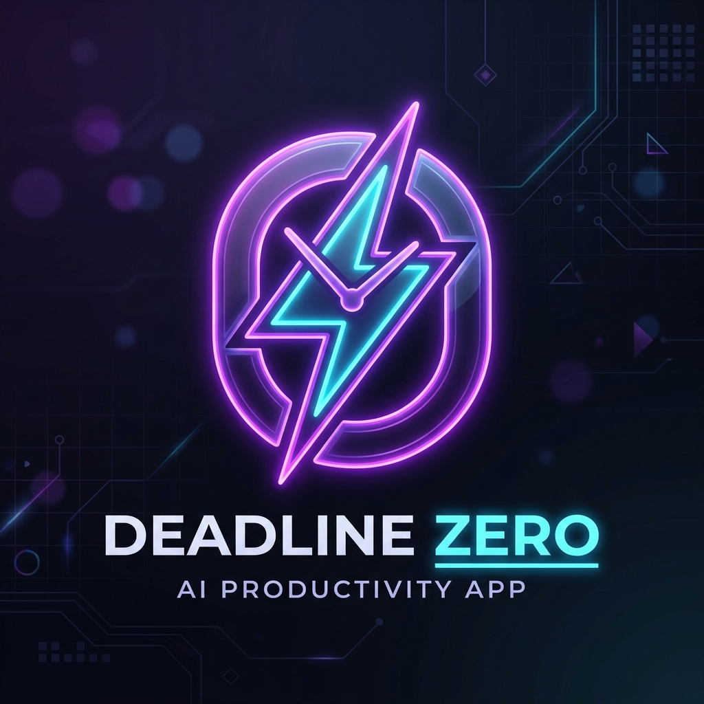
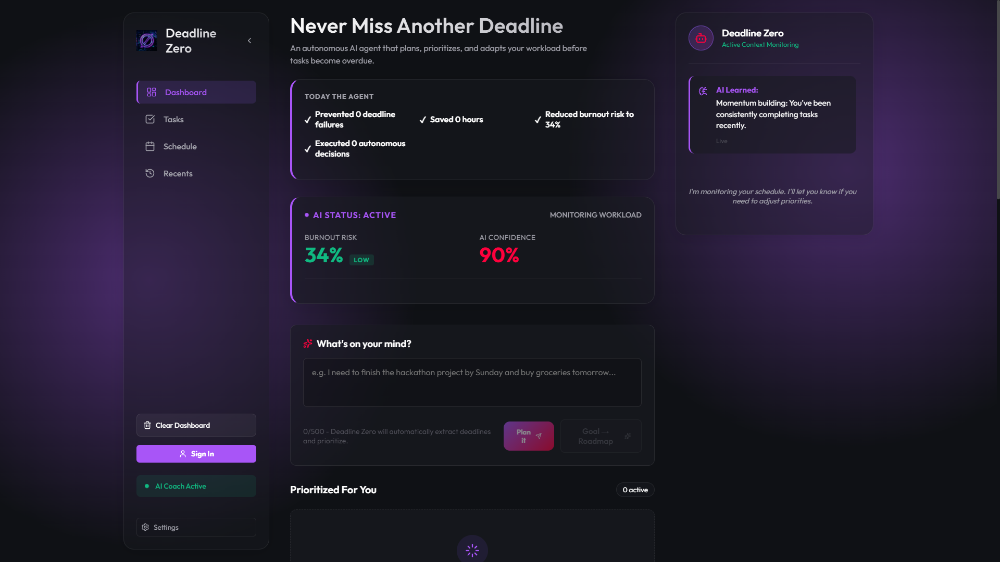
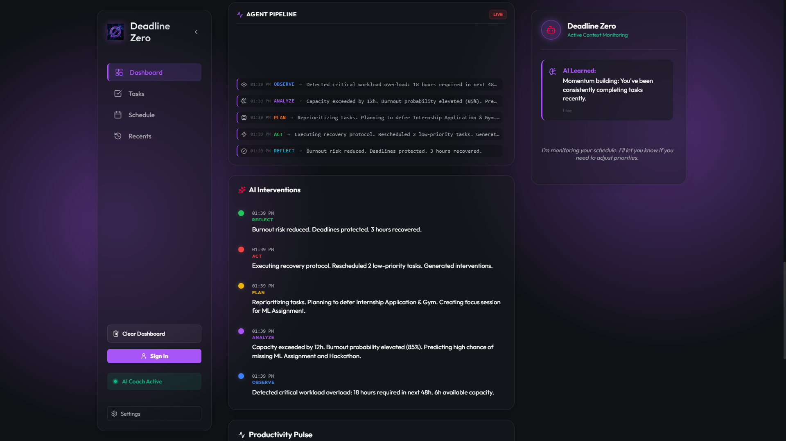
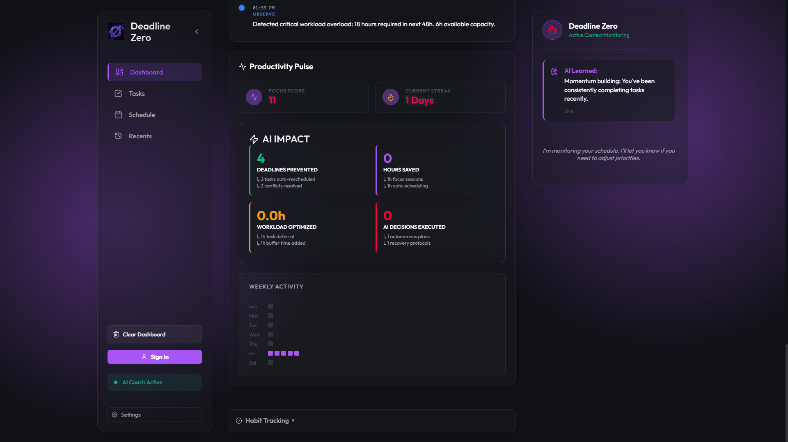
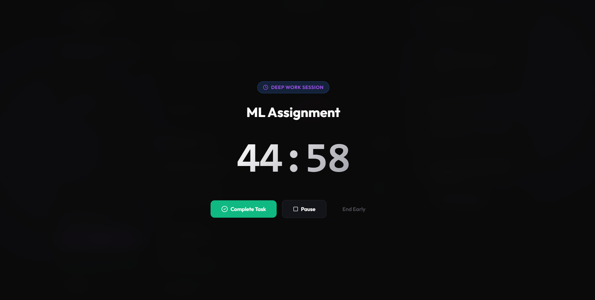

<div align="center">
  

  <h1>Deadline Zero</h1>
  <p><strong>An Explainable Autonomous AI Agent that prevents missed deadlines, burnout, and productivity failure before they happen.</strong></p>

  <p>
    <a href="https://nextjs.org/"></a>
    <a href="https://www.typescriptlang.org/"></a>
    <a href="https://deepmind.google/technologies/gemini/"></a>
    <a href="https://firebase.google.com/"></a>
    <a href="https://zustand-demo.pmnd.rs/"></a>
    <a href="https://tailwindcss.com/"></a>
    <a href="https://cloud.google.com/"></a>
  </p>
</div>

---

## 🎥 Live Demo

<div align="center">
  
</div>

<div align="center">
  <a href="https://deadline-zero.web.app"><strong>Try the Live Demo</strong></a>
</div>

---

## 🚨 Problem Statement

**The "Last Minute Life Saver" Challenge.**
In today's fast-paced world, professionals and students constantly juggle multiple tasks, leading to missed deadlines, chronic burnout, and ultimate productivity failure. The modern workflow demands an intelligent system that acts *before* a failure occurs.

### Why Traditional Reminder Apps Fail
Most productivity tools like ToDoist or Google Calendar are **reactive**. They wait for you to input a task and remind you when it's due. If you fall behind, they just turn red. They don't help you catch up, they don't predict if you will fail, and they don't intervene to restructure your workload.

### How Deadline Zero Solves It
Deadline Zero is **proactive**. It monitors your habits, parses your goals, and creates actionable roadmaps. If it detects a high likelihood of burnout or a missed deadline, it intervenes by autonomously rescheduling tasks and advising you on how to optimize your focus—effectively preventing failure before it happens.

---

## 🧠 Our Solution

Deadline Zero is **"An Explainable Autonomous Deadline Prevention Agent."**

The AI does not merely remind users. Instead, it follows a continuous autonomous loop:
- 👁️ **Observe:** Monitors your task progress, work habits, and upcoming deadlines.
- 🔬 **Analyze:** Evaluates urgency, detects signs of burnout, and predicts potential failure.
- 📝 **Plan:** Generates roadmaps and restructures your schedule dynamically.
- 🚀 **Act:** Autonomous task prioritization, calendar rescheduling, and triggering deep work modes.
- 🔄 **Reflect:** Explains its decisions and learns from your productivity patterns over time.

---

## ⚙️ AI Architecture

```text
User
  ↓
Brain Dump
  ↓
Gemini Parser
  ↓
Task Extraction
  ↓
Planner
  ↓
Burnout Engine
  ↓
Decision Engine
  ↓
Mission Control
  ↓
Schedule
  ↓
Analytics
  ↓
Activity Feed
  ↓
Explainability Layer
```

---

## 🌟 Features

### 🤖 AI Intelligence
- **Natural language task parsing:** Dump your brain, let AI organize it.
- **Goal to roadmap generation:** Breaks big goals into micro-tasks.
- **AI urgency scoring:** Dynamically evaluates what needs your attention *now*.
- **Burnout prediction:** Warns you before your workload becomes unsustainable.
- **Predictive deadline failure detection:** Knows if you won't make it based on your current pace.
- **Autonomous rescheduling:** Shifts tasks automatically when you fall behind.
- **AI scheduling:** Optimizes your day based on your energy levels.
- **Explainable AI decisions:** You always know *why* the AI changed your schedule.
- **Agent confidence scoring:** Shows how certain the AI is about its predictions.
- **Decision archive & Agent memory:** Remembers what works for you.
- **Transparent AI pipeline:** Complete visibility into the AI's reasoning.

### ⏱️ Productivity
- **Focus Mode & Pomodoro:** Built-in timers for deep work.
- **Calendar scheduling:** Seamless time-blocking.
- **Task prioritization:** Auto-sorts your backlog.
- **Habit tracking:** Monitors consistency.
- **Analytics & Mission Control dashboard:** Your productivity command center.
- **Notifications & Alarm manager:** Smart alerts that don't distract.

### ☁️ Google Technologies
- **Gemini API:** Core intelligence and NLP.
- **Firebase Authentication:** Secure login.
- **Firestore:** Real-time database.
- **Firebase Hosting:** Fast, global delivery.
- **Google Cloud Deployment:** Scalable infrastructure.

---

## 🔍 Explainable AI

We believe AI should not be a black box. Every action taken by Deadline Zero is transparent. The Explainability Layer breaks down every decision into:
- **Observation:** What the AI noticed (e.g., "You have 5 high-priority tasks and only 2 hours").
- **Analysis:** What it means (e.g., "High risk of missing the 5 PM deadline").
- **Decision:** What the AI did (e.g., "Rescheduled low-priority tasks to tomorrow").
- **Reasoning:** Why it did it (e.g., "To free up 3 hours of deep work today").
- **Expected Outcome:** The predicted result.
- **Confidence & Impact:** A score reflecting the AI's certainty and the change's significance.

This builds trust, showing users that the AI is acting in their best interest.

---

## 📸 Screenshots

| Mission Control | AI Activity Feed |
| :---: | :---: |
|  |  |

| Analytics Dashboard | Focus Mode |
| :---: | :---: |
|  |  |

---

## 💻 Tech Stack

| Category | Technology |
|---|---|
| **Frontend** | Next.js 14, React 19, TypeScript |
| **Styling** | Tailwind CSS, Framer Motion, Lucide Icons |
| **State Management** | Zustand |
| **AI / NLP** | Google Gemini API |
| **Backend & Database** | Firebase / Firestore |
| **Authentication** | Firebase Authentication |
| **Deployment** | Firebase Hosting / Google Cloud |

---

## 🚀 Installation & Local Development

1. **Clone the repository:**
   ```bash
   git clone https://github.com/yourusername/deadline-zero.git
   cd deadline-zero/proacta
   ```

2. **Install dependencies:**
   ```bash
   npm install
   ```

3. **Set up Environment Variables:**
   Create a `.env.local` file and add your keys:
   ```env
   NEXT_PUBLIC_FIREBASE_API_KEY=your_firebase_api_key
   NEXT_PUBLIC_FIREBASE_AUTH_DOMAIN=your_firebase_domain
   NEXT_PUBLIC_FIREBASE_PROJECT_ID=your_project_id
   NEXT_PUBLIC_FIREBASE_STORAGE_BUCKET=your_storage_bucket
   NEXT_PUBLIC_FIREBASE_MESSAGING_SENDER_ID=your_sender_id
   NEXT_PUBLIC_FIREBASE_APP_ID=your_app_id
   GEMINI_API_KEY=your_gemini_api_key
   ```

4. **Run the development server:**
   ```bash
   npm run dev
   ```

---

## 📁 Folder Structure

```text
proacta/
├── public/                 # Static assets (images, icons, etc.)
├── src/                    
│   ├── app/                # Next.js app router & pages
│   ├── components/         # Reusable React components
│   ├── hooks/              # Custom React hooks
│   ├── lib/                # Utility functions & Gemini API integrations
│   ├── store/              # Zustand state management
│   └── types/              # TypeScript definitions
├── docs/                   # Architecture, pipelines, and screenshots
│   └── screenshots/        
├── .env.local              # Environment variables (local)
├── next.config.ts          # Next.js configuration
├── tailwind.config.ts      # Tailwind CSS configuration
└── package.json            # Dependencies & scripts
```

---

## 🔮 Future Roadmap

- [ ] **Voice Assistant** integration for hands-free planning.
- [ ] **Google Calendar API** sync.
- [ ] **Email AI** & **Slack Integration** to parse tasks from communications.
- [ ] **WearOS & Mobile App** for on-the-go notifications.
- [ ] **Advanced AI Memory** to learn from your long-term behaviors.

---

## ⚔️ Why Deadline Zero is Different

| Feature | Deadline Zero | Google Calendar | Todoist | Traditional Reminders |
|---|:---:|:---:|:---:|:---:|
| **Proactive Intervention** | ✅ | ❌ | ❌ | ❌ |
| **Burnout Prediction** | ✅ | ❌ | ❌ | ❌ |
| **Explainable AI Actions** | ✅ | ❌ | ❌ | ❌ |
| **Autonomous Rescheduling** | ✅ | ❌ | ❌ | ❌ |
| **Predictive Failure Alert** | ✅ | ❌ | ❌ | ❌ |

Deadline Zero doesn't just manage your time; it actively protects it.

---

## 👥 Contributors

- **SUBHAM ROY** - *Lead Developer / AI Engineer* - [@subhamroy-Musicman](https://github.com/subhamroy-Musicman)

---


<div align="center">
  <p>Built with ❤️ using Google AI, Firebase, Next.js and Gemini.</p>
</div>
